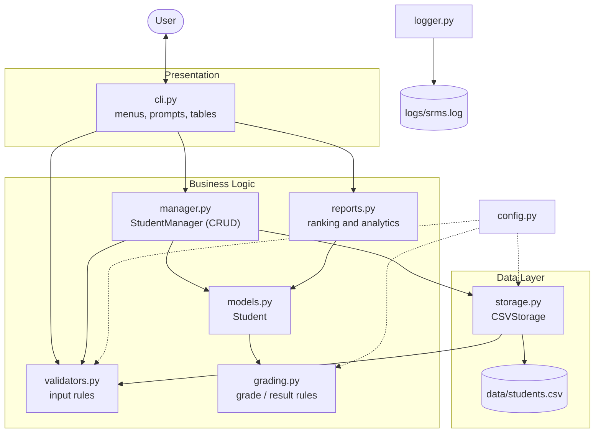
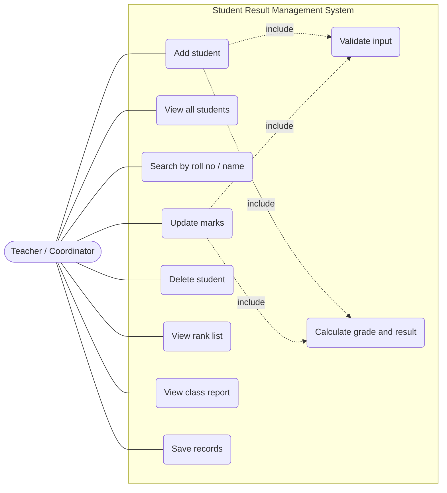
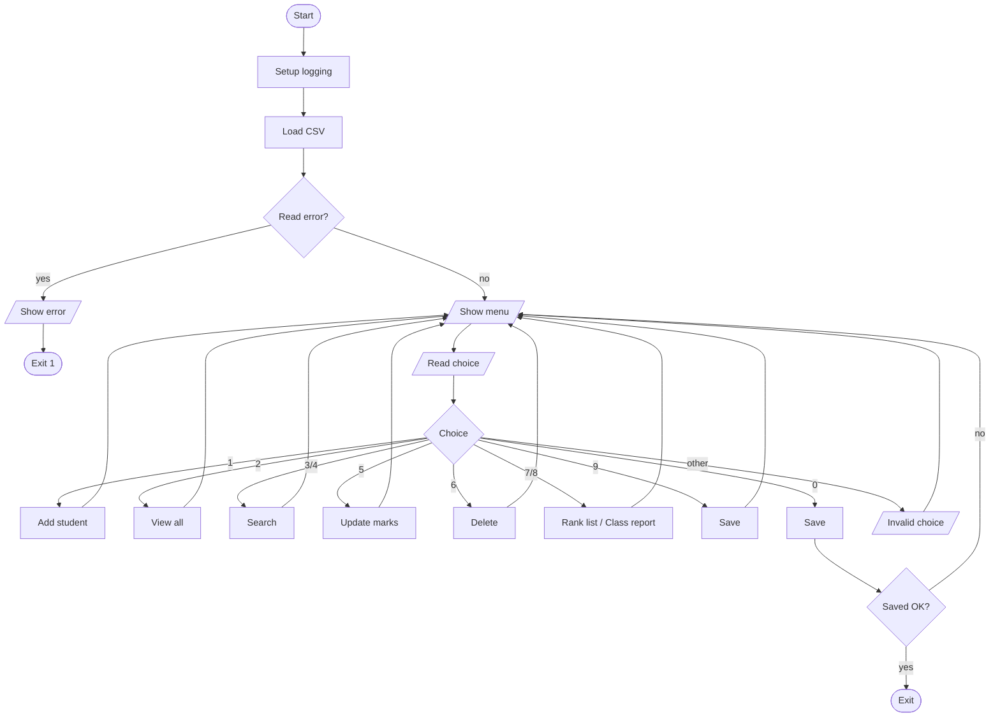
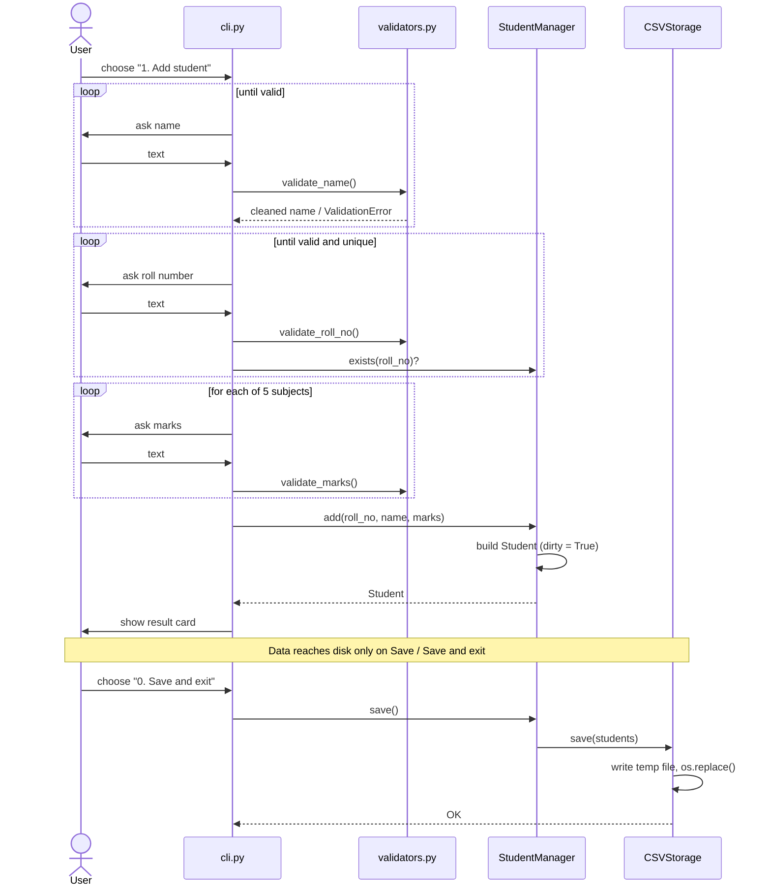
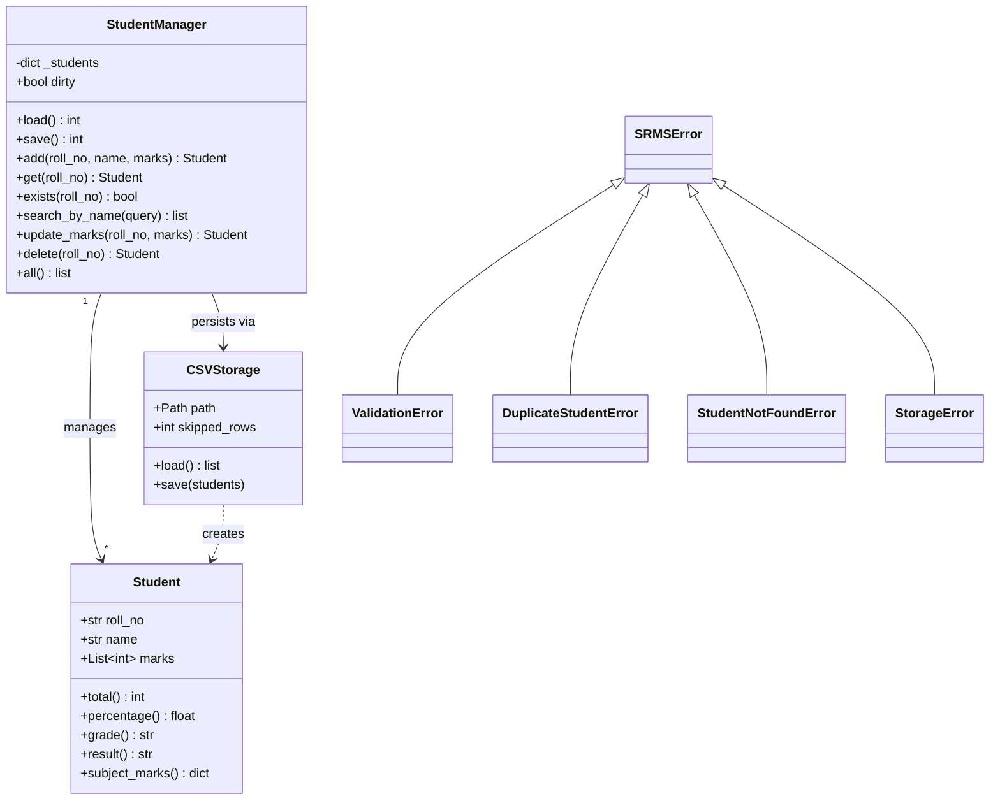
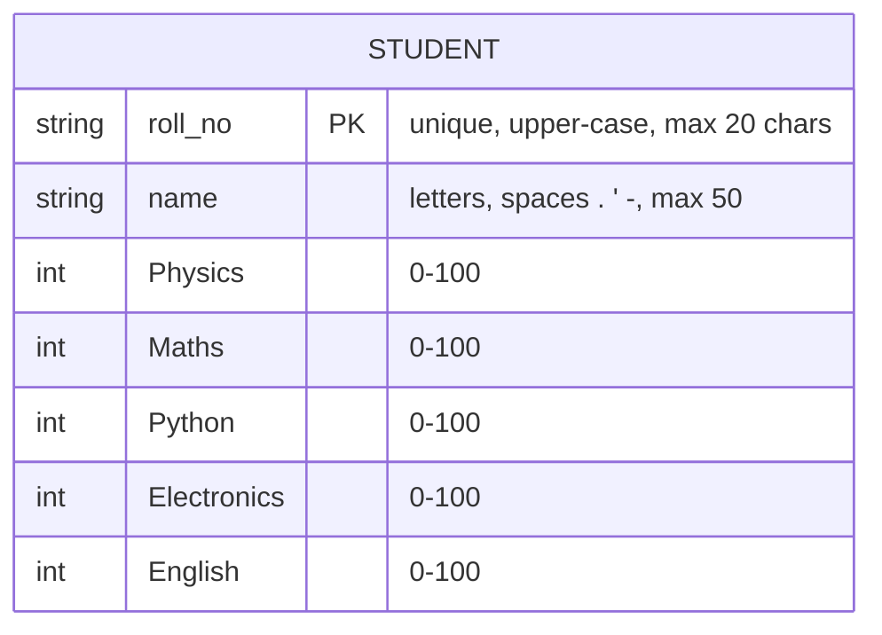

# Design

All diagrams are written in [Mermaid](https://mermaid.js.org/) and render directly on GitHub.

## 1. System Architecture

Layered design: the UI never touches files directly, and the business logic never prints or reads input.



## 2. Use Case Diagram



## 3. Workflow Diagram



## 4. Sequence Diagram - Add a Student



## 5. Class / Component Diagram



Module-level function groups (no state, so not classes): `grading` (total, percentage, grade, result), `validators` (name, roll number, marks), `reports` (rank list, averages, distribution, summary), `cli` (menu actions).

## 6. Storage Design (ER Diagram)

Storage is a single CSV file, so there is one entity. Marks are stored one column per subject.



`total`, `percentage`, `grade` and `result` are **derived** at run time and deliberately not stored, so they can never become inconsistent with the marks.

**Schema (`data/students.csv`)**
```
roll_no,name,Physics,Maths,Python,Electronics,English
21BCE001,Asha Rao,92,88,95,90,85
```

## 7. Design Decisions and Rationale

| Decision | Alternatives considered | Why this choice |
|----------|-------------------------|-----------------|
| Layered modules (UI / logic / storage) | Single script (the original version) | Logic can be unit-tested without keyboard input; storage can be swapped (e.g. SQLite) without touching the UI |
| `Student` stores only roll no, name, marks; other values are properties | Store total/percentage/grade in the object and the file | No stale or inconsistent values after an update |
| Dictionary keyed by roll number | List + linear search | O(1) look-up, and duplicates are impossible by construction |
| `csv` module | Manual `",".join()` / `split(",")` | Correctly handles quoting; the original approach breaks if a name contains a comma |
| Atomic save (temp file + `os.replace`) | Write directly to the file | A crash mid-write cannot leave a half-written data file |
| Skip and log corrupt rows | Crash / silently ignore | The app stays usable and the user is warned |
| Custom exception hierarchy | Return codes / bare `print` | Callers handle each failure precisely; one `except SRMSError` covers all expected errors |
| Percentage computed as `total * 100 / max_total` | `total / max * 100` | Integer arithmetic first avoids floating-point errors at grade boundaries (e.g. 57% computing as 56.999...) |
| Grade depends on percentage; PASS/FAIL on per-subject minimum | Force grade F when failing | Matches the original program's rules; a student can therefore be "B" and "FAIL" if one subject is below 40 |
| Roll numbers normalised to upper case | Case-sensitive | `21bce001` and `21BCE001` cannot become two different students |
| Standard library only | `pandas`, `rich`, SQLite | Zero installation effort; enough for the problem size |
